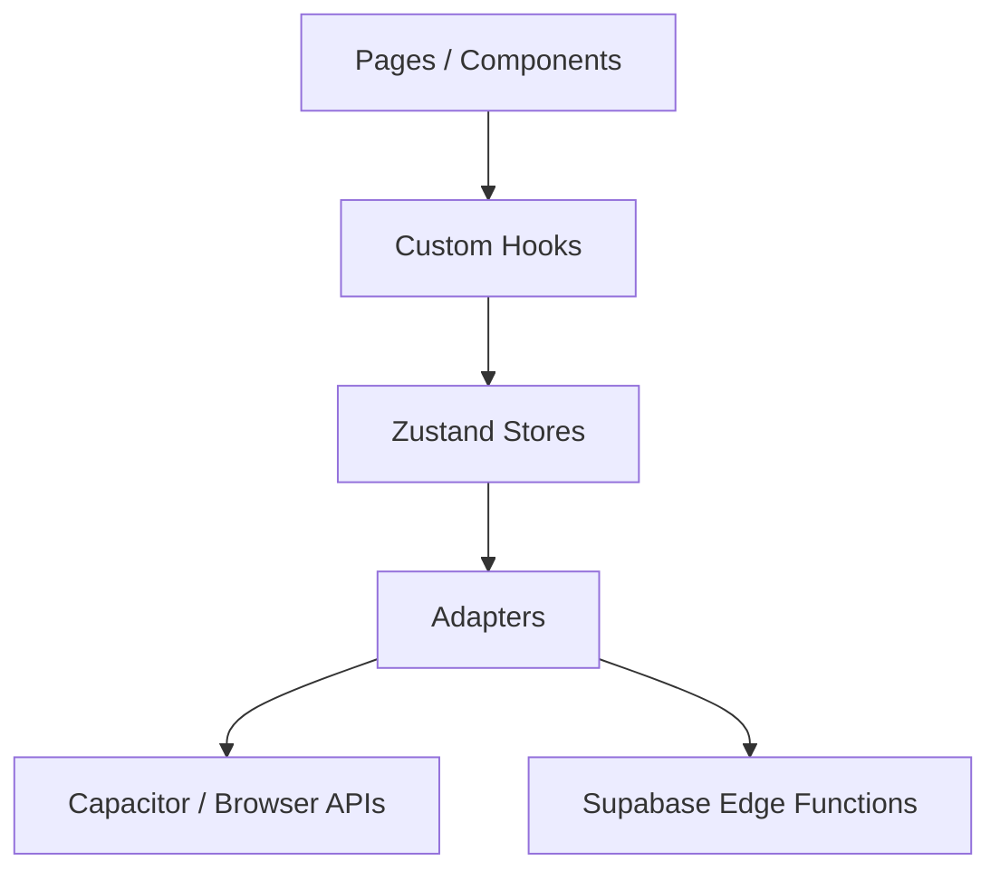
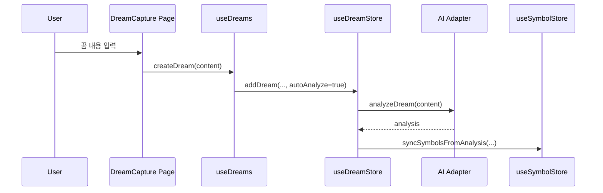
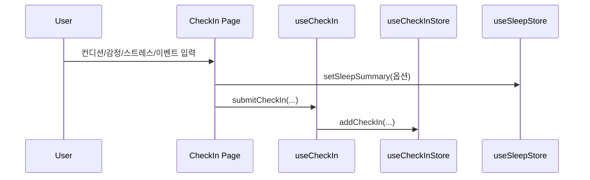
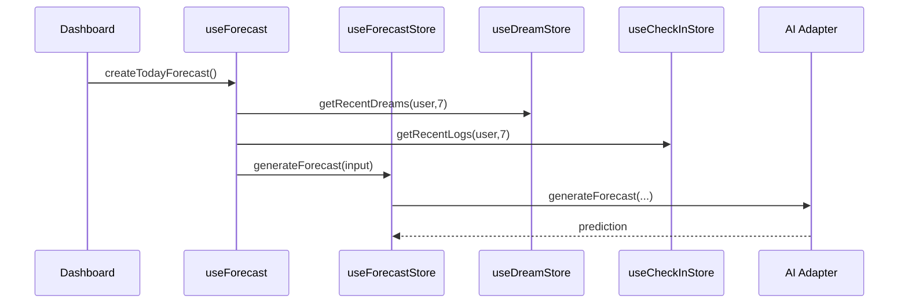

# DreamSync Architecture

## 런타임 구조 (현재 코드 기준)

핵심 원칙:

- 화면 로직은 `pages/components`에 유지
- 비즈니스 조합은 `hooks`에서 수행
- 상태 저장/조회는 `store`가 단일 진입점
- 외부 연동은 `adapters`로 분리

## 디렉토리 역할

- `src/pages`: 화면 단위 라우트
- `src/components`: 재사용 UI 및 도메인 컴포넌트
- `src/hooks`: 화면-상태 조합 로직
- `src/store`: Zustand 상태/액션 (실질 소스 오브 트루스)
- `src/lib/adapters`: AI/Storage/Analytics/API 추상화
- `src/lib/scoring`: confidence/UHS 계산 로직
- `src/lib/services`: store 기반 서비스 파사드
- `supabase/functions`: Edge Function (`ai-proxy`, `rate-limit`, `audit-log`)

## 핵심 데이터 플로우

### 1) 꿈 기록

### 2) 체크인

### 3) 예보

## Store 목록

- `useAuthStore`: 인증/사용자/온보딩
- `useDreamStore`: 꿈 기록/분석 상태
- `useCheckInStore`: 일일 체크인
- `useForecastStore`: 예보/정확도
- `useSymbolStore`: 개인 심볼 사전
- `useSleepStore`: 수면 요약(수동/웨어러블)
- `useFeatureFlagStore`: 기능 플래그
- `useSettingsStore`: 앱 설정

## Adapter 구성

| Adapter | 모드 | 선택 기준 |
|---|---|---|
| AI | `mock` / `edge` | `VITE_AI` + `edgeAI` feature flag |
| Storage | LocalStorage(웹) / Preferences(네이티브) | 런타임 플랫폼 |
| Analytics | `mock` / `mixpanel` | `VITE_ANALYTICS` |
| API | `local` / `supabase`(준비) | `VITE_BACKEND` |

## 오프라인 전략

- 기본 데이터는 Zustand persist로 로컬 저장
- `syncQueue`는 큐 저장/복구/재시도 틀만 구현
- 실제 원격 동기화(`processItem`)는 Phase 2에서 확장 예정

## 보안/프라이버시

- 민감 텍스트 로그 금지: `maskSensitiveFields`, `maskDreamContent` 사용
- 클라이언트에서 서버 비밀키 미보유
- Edge Function 경유 시에도 요청/응답 스키마 검증 유지

## 현재 경계(Important)

- Supabase Edge `ai-proxy`는 현재 스텁 응답 포함
- 일부 Phase 2+ 모듈은 준비 코드(플러그인/SDK 의존성 미설치 상태)
- 실제 제품 동작 기준 진입점은 `hooks + stores + adapters`
